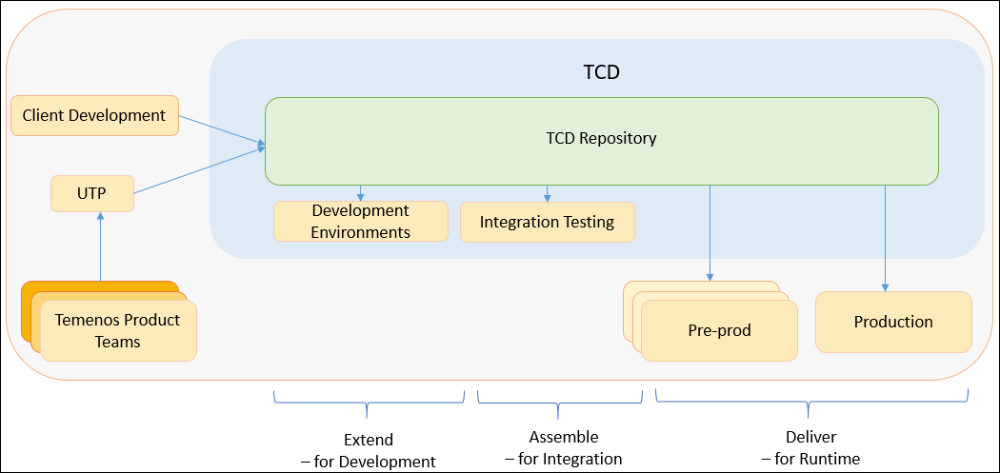
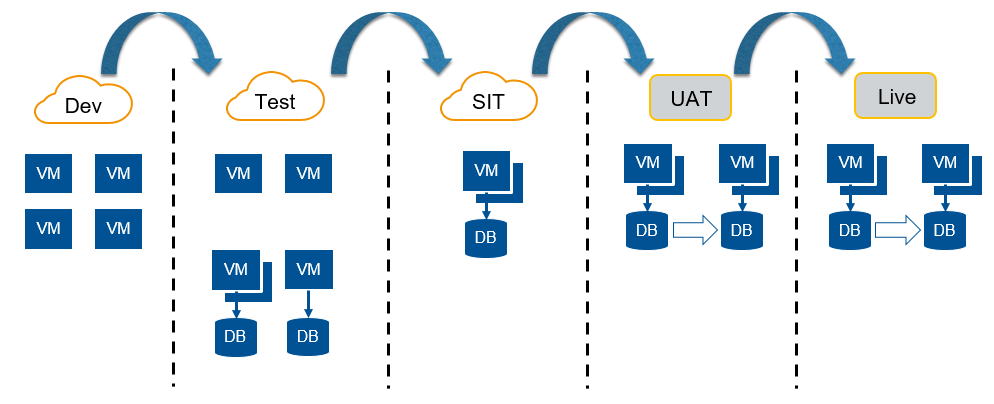
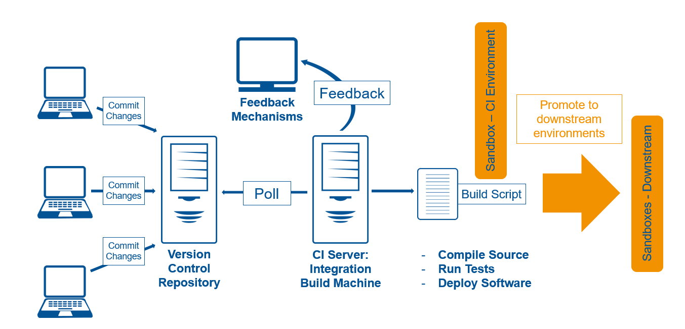

# Architecture Overview

### **Overview**

This section provides an overview of what the Temenos Continuous Deployment solution is, and how it fits in with the wider Temenos and bank enterprise.

*Enterprise View*

The Temenos Continuous Deployment solution is composed of the **Extend** and **Assemble** modules to enable the provision of development and Integration test environments. The current state allows for these two modules only. Roadmap features envisage a Deliver module to cover pre-production and production environments.

The **The  Extend module** is a multi-tenanted provisioning and deployment module that provides Users and/or other systems with self-service management of Environments and provides access to the tools for enhancing Client Licensed Temenos Software. The Extend module enables authorised Users to provision Environments from a list of Templates for non-production use during development, test, integration, implementation and ongoing changes to the Products. The Extend module is a cloud-hosted platform service and manages Environments in either the Temenos cloud or a Client’s Target Cloud account.

Each **Environment** is a standalone instance of one or more Products or approved third-party applications / products running on the middleware defined in the Template.

Each **Factory** is formed of an Environment and one or more Test Clients. The Test Clients have their own Templates, which define their infrastructure, software Components and configuration.

The **The  Assemble module** performs the test pipeline automation, continuous integration (“CI”) and continuous delivery (“CD”) of Client’s changes to Client’s Licensed Temenos Software. The Assemble Module utilises the same technologies as the Extend module, and does:

- deploy Test Clients;
- execute the Clients’ tests;
- orchestrate the deployment of Environments with Factories and the promotion of Packages through a workflow;
- manage storage of test results and application logs;
- manage the lifecycle of test Environments;
- provide a dashboard of test results with links to the underlying manifests, templates and, where appropriate, running Environments.

The **Temenos Continuous Deployment test result dashboard** is a multi-tenanted web application hosted and operated by Temenos. The dashboard shows historic test results for a Factory within a configured Release and trends through a web UI pulling data from the Assemble Modules local database and test results and application logs in Target Cloud storage.

The **Temenos Continuous Deployment  Artifact Repository** is a third-party artifact repository “Artifactory by Jfrog” . The repository holds all the built software Components that are referenced by the Templates at the relevant test and deploy Stages. The Client will push all of its Product packages to the Artifact Repository

The Temenos Continuous Deployment platform has two distinct deployment domains as below:

 - the “Platform Cloud” where the provisioning software runs;
 
 - the “Target Cloud” where the T24 environments are provisioned.

 
 

### **Where does Temenos Continuous Deployment Platform fit into the enterprise IT landscape?**

----------
The Temenos Continuous Deployment Platform promotes the concept of simplified and standardised change promotion through the IT landscape.

Typical organisations have a number of non-production (i.e. development/test) environments, where changes are implemented and checked prior to deployment to production systems. The Devops movement seeks to improve this QA process through means of automation, which both allows an increase in speed in change promotion, and a reduction in the risk of manual errors when promoting changes.

The Development Platform includes a simple and repeatable method of collating changes (both configuration and customisation) which subsequently is simple to promote from environment to environment.

In addition, the core function of the Deployment Platform  is to simplify the environment provisioning process, which means if extra stages in the change flow are required (e.g. for additional testing phases), it becomes far simpler to spin up temporary environments for these purposes.

It should be noted that the Development platfrom only supplies non-production environments (also known as 'sandboxes'), which means organisations will still require at least one non-production environment on representative hardware in order to sanity check changes prior to production release (see example below).

Delegating platform and infrastructure responsibilities to a third party allows organisations to concentrate on what is important to them - applications and data.

The Deployment platform may be used for simple environment provisioning, or may be augmented by additional tools (such as Continuous Integration tooling) to provide a streamlined and automated development experience. The change promotion mechansim within the Temenos Continuous Deployment  is simple to plug into standard CI tooling to push code/config/data from environment to environment.  An example development flow is shown below:

 
 

### **What are the components of Temenos Continuous Deployment?**

----------

Development & Testing environments are managed by the Development Portal, and are comprised of distinct components as described below:

| Component  				| Description	| 
| :---  					| :---  	| 
| Portal			|	The Portal is the front-end component of the Deployment Platform which allows users to perform management functions across development environments.  These functions include user management and environment provisioning/scaling.| 
| Configuration Repository			|	The Configuration Repository is the 'change hub' for the Deployment Platform.  It supports configuration and customisation (per environment), including T24 updates, custom config/code packages, database imports and third party plug-ins/add-ons.|
| T24 Instance		|	The T24 instance comprises the application and database for T24.  The application tier may be scaled horizontally as required (via the management facility in the Portal).|
| Exports (File Storage)			|	The T24 database may be exported via the management facility in the Portal, as may the 'environment' (file system level). These exports are stored per environment and may be downloaded by users via SFTP.|

 
 

### **What tools do I need to use Temenos Continuous Deployment?**

----------

Below is a list of tools which may be used to exploit Temenos Continuous Deployment functionality.

| Tool 	| Description   and Rationale 	|
|----------------------------	|-------------------------------------------------------------------------------------------------------------------------------------------------------------------------------------------------------------------------------------------------------------------------------------------	|
| Git 	| Git   (/ɡɪt/) is a version control system for tracking changes in computer files   and coordinating work on those files among multiple people. A client program   for Git is required to push artifacts into the configuration repository. 	|
| SFTP   Client 	| SFTP   is the protocol used to download file exports (environment or database   exports) 	|
| Design   Studio | Design   Studio is the IDE (Integrated Development Environment) produced by Temenos   for developing changes in T24 systems. Design Studio itself does not form   part of the Deployment Platform, but change outputs from this tool are   supported within the Configuration Repository. 	|

