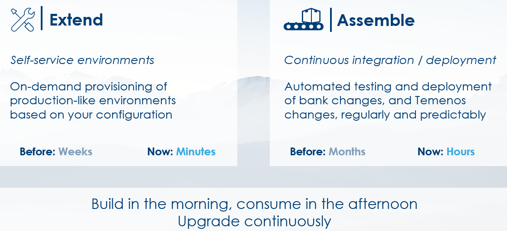
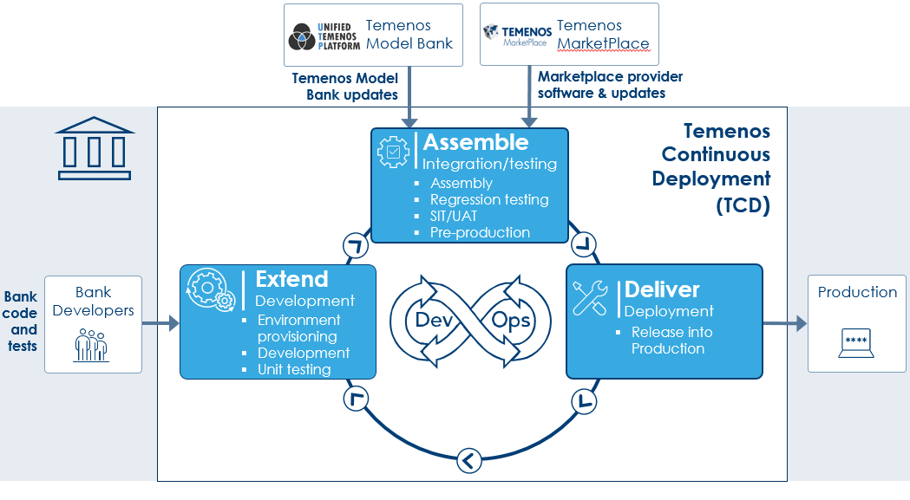

## **What is Temenos Continuous Deployment?**

Temenos Continuous Deployment (TCD) is an offering from Temenos SaaS that provides client individuals and teams with the ability to manage, configure and assemble client licensed Temenos Software.

Temenos Continuous Deployment enables you to create Environments, i.e. Temenos Suites on-demand, for non-production use in the cloud. The speed, reliability, and agility of these environments will instantly add value to your implementation and scale your project delivery capacity. 

## **Temenos Continuous Deployment**

## **What is the “Assemble” service module of the Temenos Continuous Deployment?**

“Assemble” module provides a DevOps solution to perform continuous integration and delivery of Temenos Products, its customisation and thereby enabling faster time to market. 

The Assemble service module can accelerate the pace of change and increase confidence in the software deliveries by managing the Assemble of Components (updates, main release, and Level 3 developments), the provisioning into testing Environments, the execution of tests scripts, and providing detailed dashboards of the results. This Assemble service module further allows the Client to configure Products and Releases, which match their own specific needs. The main objective being to streamline ongoing change and accelerate implementation / upgrade projects. 

## **What is the “Extend” service module of the Temenos Continuous Deployment?**

The Extend module of the Temenos Continuous Deployment is used by the ‘change the bank’ teams for self-service management of Environments and provides access to the tools for enhancing Temenos solutions. The portal enables authorised users to provision Environments from a list of Templates. These Environments are for non-production use during development, test, integration, implementation phases. 

## **Features**

----------

**Self-service environment provisioning**

- An authenticated user, e.g. a developer or tester, has the ability to request an environment from the catalogue of templates; this template will be materialised into compute, storage, and networks on the Temenos SaaS. See architecture. The administrator, e.g. the project manager, is in control of number of the users and maximum number of running environments, thus having total control of the platform and its usage. 

**Secure configuration and environment management**

- A developer, is able to configure a personal SSH Key on their user profile and use this key to securely push changes over SSH. Deployment of change into the environment is fully automated for configuration, updates, plugins, add-ons and data. These changes can be stored in a software configuration management repository and deployed to the environment via a Continuous Integration / Continuous Deployment process. 

**Controlling the environment**

- A user is able to start, stop, delete, and export data from an environment. Furthermore, a user is able to push a database into the configuration repository and rebuild the environment, thereby refreshing the database back to that point in time and re-apply transactions and configuration as required. 

- As an example, a developer or a tester can load a database and collaborate to validate changes and test cases in a shared environment. Should these users need to delete or migrate an environment, they can export the data, create a fresh environment with the latest release, upload the data and continue working all managed through the portal.  

**Monitoring the environment**

- A user can export the application log data, monitor the status of the environments (started, starting, stopped, stopping, rebuilding), and see the results of any application deployments. 

**Controlling the application**

- The Temenos core banking template exposes endpoints for the user interface and TAFJEE management screens that allows a user to control COB job services. 

