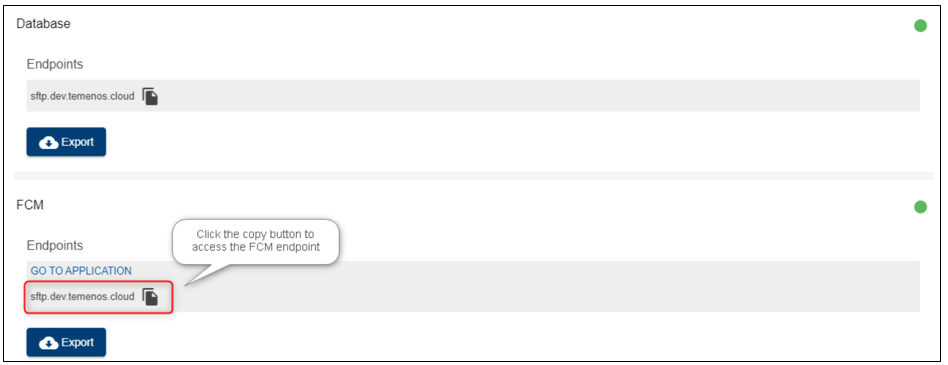
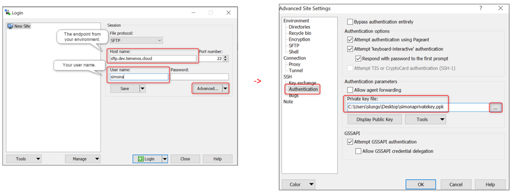
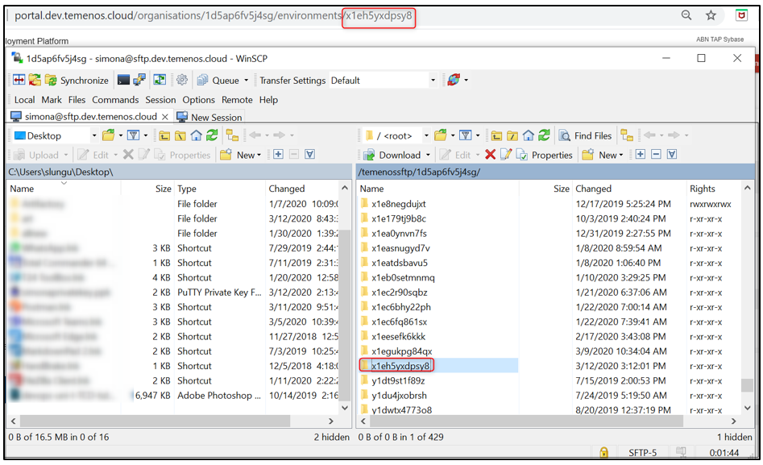
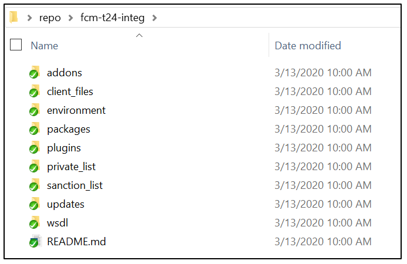

**Access FCM UD Directories via SFTP and GitLab**

Learn how to easily access the FCM UD directories of your sandbox, without the need of exporting zip files, but using symbolic links on the SFTP server to the T24 VM machines or cloning the environment on your local machine.

# Access FCM UD Directories via SFTP #
## Create New Environment ##
Learn how [here](http://documentation.temenos.cloud/home/techguides/manage-environments.html). Mentions:

- From Cloud Native field select **FCM**
- Please select the **FCM Template** that was assigned to your organisation

It will take about 15-20 minutes for the new environment to be created

## Create a User on the Portal ##

This is required later when connecting to T24 through SFTP server connection, because it checks the authentication to the cloud environment with that specific user and the attached SSH key. 

To see all the steps regarding how to add a new user on the portal and to attach the SSH key, please see the following user guide about how to [**Create Users**](../techguides/user-creation-in-paas.md).

## Connect via SFTP Client ##

 - In order to have access to the FCM Cloud Application live folders, you can install an FTP client from [https://winscp.net/eng/index.php](https://winscp.net/eng/index.php)
 - Open WinSCP application and fill the mandatory fields:
    - Host name > copy it from the environment endpoint: sftp.temenos.cloud *(see image below)*
    - User name > input the exact name of the user added to the portal
&nbsp;&nbsp;&nbsp;&nbsp;&nbsp;&nbsp;&nbsp;&nbsp;&nbsp;&nbsp;&nbsp;&nbsp;
- Click **Advanced**
- In the new screen, select **SSH Authentication** 
- Upload the private key previously saved (corresponding to the public key attached to the portal user)
- Click **OK**

 - Previous screen pops-up, click **Login**

## Check and Use Live Folders  ##

 - After logging in, on the right window, locate your environment ID

  

-  Double click to access the live folders of the environment

-  You will be able to see and access the following T24 live folders structure. These folders will be populated by the client with the accounts, customer-information and operations desired. Once processed the formation will dissapear from SFTP and will be visible in the FCM application.

   - **accounts**
   - **customer-information**
   - **operations**

  

# Access FCM UD Directories via GitLab #
Clone the GitLab repository of your Environment in your local machine. For more details on how to clone a repository, check this [page](http://documentation.temenos.cloud/home/techguides/deploy-an-update-to-an-existing-environment.html#clone-environment-repository). The cloned repo will look as per the screenshot below. 
&nbsp;&nbsp;&nbsp;&nbsp;&nbsp;&nbsp;

- click to open the folder 

 

| **Folder** 	| Functionality 	|
|-----------------------	|-------------------------------------------------------------------------------------------------------------------------------------------------------------------------------------------------------------------------------------------------------------------------------------------------------------------------------------------------------------------------------------------------------------------------------------------------------------------------------------------------------------------------------------------------	|
| addons 	| This folder is designed for AppDynamics. Upload files as JAR. 	|
| client_files\h2db 	| Local H2 database that will be uploaded to the Cloud Environment. Database username must be t24 and password t24 (case sensitive). Database name is mandatory to be “TAFJDB.h2.db” (case sensitive) and must be archived as a ZIP with name TAFJDB.zip (case sensitive). If the above conditions are not satisfied, the database will not be uploaded to the Cloud Environment. This procedure will **replace** the existing database in the cloud with this one. The **old database** will be **lost**, including any records loaded manually. 	|
| client_files\helptext 	| Custom Help Text files can be uploaded in this folder. The file structure must be the same as HELP.TEXT T24 core. Thus, under client_files\helptext folder, the HelpText folder with subfolders for each component (AA, EB, PP, etc.) is expected. 	|
| packages 	| One or more T24 DS (Design Studio) packages can be uploaded into this folder. All packages will be deployed automatically inside T24. 	|
| plugins 	| WAR files can be uploaded in this folder. The files will be deployed inside Jboss EAP. In addition to this, endpoints related to plugins can be automatically added to an application. For more details, check this <a href="./add-app-endpoint.md" target="blank">guide</a>. 	|
| private_list 	| CSV files can be uploaded in the folder. The updates will be reflected in the FCM application. 	|
| sanction_list 	| CSV files can be uploaded in the folder. The file contains the client's FCM database and once deployed it will appear in the FCM application. 	|
| updates 	| The updates files downloaded from the portal in zip format. The files will be copied to the update folder and the T24 Update procedure is triggered. 	|
| wsdl 	| WSDL files and folders that are required by plug-ins (war file) need to be uploaded here. 	|

