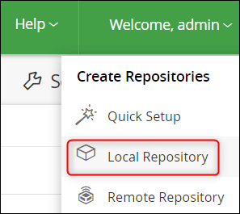
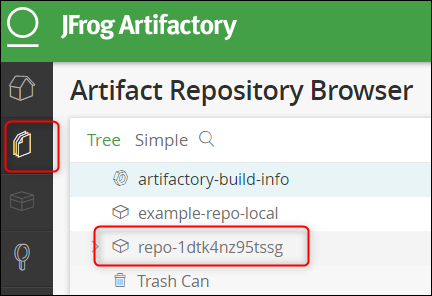
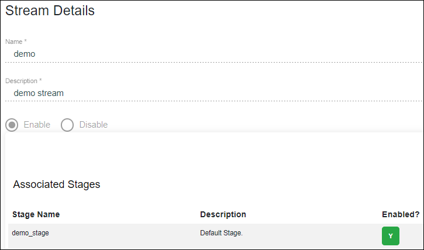
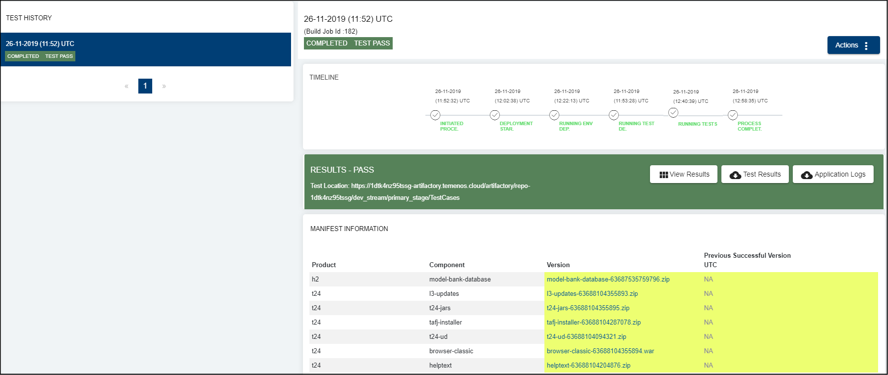
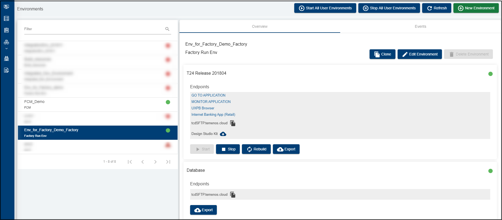
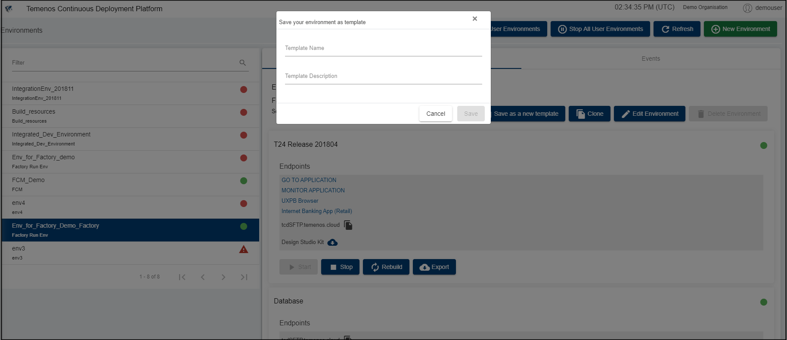
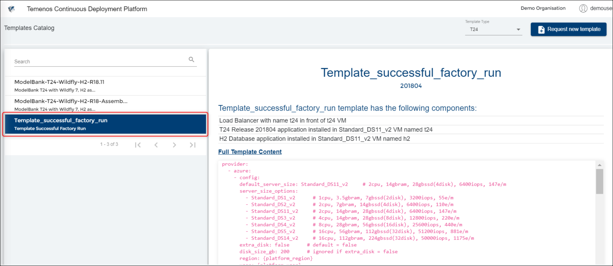

# How to Create and Publish a New Template after a Successful Factory Run 

This feature offers the possibility to baseline a particular version of a product and create a template from that version. Further anybody will be able to create an environment with the baselined version of the product.

#Prerequisites to set up the Factory:
#1. Check Metadata on the portal

- Login to the portal with your credentials.
- Click General button on the left side menu in order to see the metadata of your organization, from which you will need:
   - the ARTIFACTORY_URL
   - the DEFAULT_REPO_NAME

# 2. Create a repository into the artifactory

- Use the ARTIFACTORY_URL in order to login to the artifactory assigned to your organization.
- Login with your credentials.
- Click the Welcome button on the top right and choose **Local repository**.

- Select the package type as **Generic**.

- Fill the Repository Key with the DEFAULT_REPO_NAME from your organisation metadata on the portal.

> [!Note]
> DEFAULT_REPO_NAME from metadata and Repository Key **must** be the same.

- You can check the created repository by clicking the Artifacts button on the left side menu of the JFrog Artifactory:

# 3. Setting the Default Stage

To proceed further with all the configurations required in order to run a factory, you need to have a default stage created.

There are two possibilities to set the stage:

- Either you set it from **General** and then **Add New Metadata**:

- Or when you create a new stream (see **Streams** button on the left), if the default stage was not yet configure, a third field will appear at the stream creation requiring to add a default stage. This stage will be automatically added after to the metadata.

- After this step, the default stage will be automatically added to the repository into your Artifactory (the Artifactory link can be found into the metadata).

# 4. Setting the Stream

Go to the **Streams** buttons and click **New Stream**. The default stage will appear automatically associated.

*To see all the steps on how to create a stream, please also check the following* <a href="./stream.md" target="blank">user guide</a>.

# 5. Setting the Stage

Go to **Stages** button and make sure you create a new stage, the one in the added components will be promoted.

*To see all the steps on how to add components and create products, please also check the following* <a href="./stage.md" target="blank">user guide</a>.

# 6. Setting the Components and Products

- Go to **Products** button and make sure you add first the mandatory **components** related to the template that you need to use.
- Then configure the principle and base products. See an example of set-up below:

Also make sure you upload all the components' binaries and test cases into the related folders of the artifactory.

*To see all the steps on how to add components and create products, please also check the following* <a href="./components-products.md" target="blank">user guide</a>.

# 7. Setting the Factory

Go to **Factories** button and click **New Factory** on the top right. 

Make sure you:
- set a name
- set a description
- choose the appropriate environment and test templates
- set the source and base stages (in the below example the same stage was used in order to test the promotion of the  components along with the test cases added).
- set the principle and base products.
- click Create.

*To see all the steps on how to create a factory, please also check the following* <a href="./factories.md" target="blank">user guide</a>.
*To see all the steps on how to run a factory, please also check the following* <a href="./run-factory.md" target="blank">user guide</a>.

If the factory run is successful, the below will be displayed on the screen:

# 8. See the new environment

Expand the left side menu and click on 'Environments'. You will see the enviroment that was created following the successful factory run:

# Create and Publish the New Template after the Successful Factory Run 

Click on the newly created environment. On the right side of the page click on 'Save as a new template'. Type in the Template Name and a brief description. 

To see the new template, go to the Templates Catalogue tab. Your template is now available in your templates list.
 

