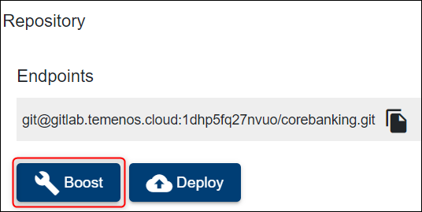
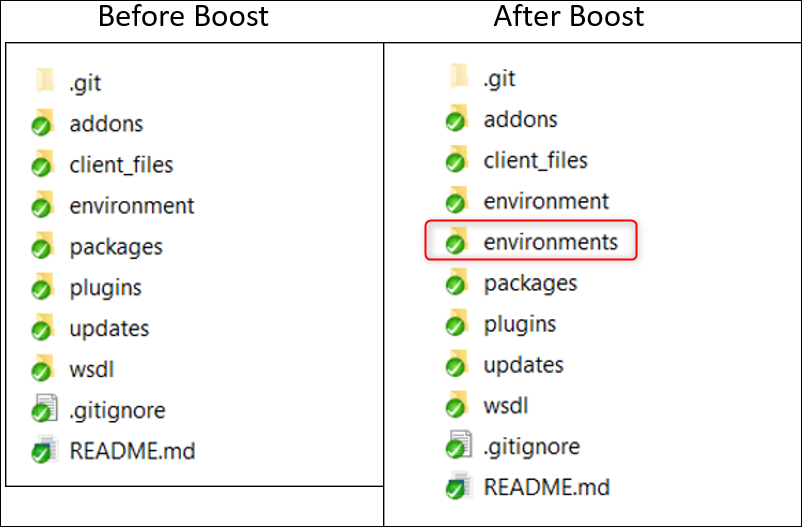
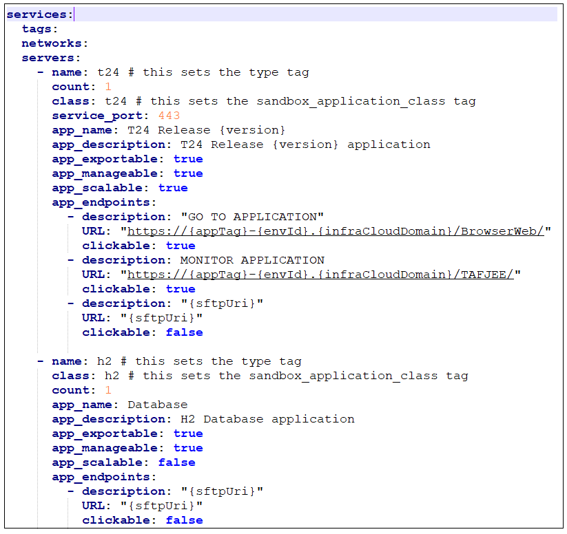

# Templates Customization
## Introduction
This document can be used by technical staff who need to customize already defined templates based on specific requirements. Templates customization will allow changes related to:
- the environment applications (i.e. the scripts to install and configure each application and the information displayed in the Portal for each application);
- the VM specifications in which each application is deployed.

> [!Note]
> This guide presumes that a environment is already created and available under an Organisation for which the templates customization functionality is allowed.

## Boost your environment
To start customizing your environment built using a Temenos Continuous Deployment Platform template, login to Temenos Continuous Deployment platform using your organisation user, go to your environment page and click on the **Boost** button attached to **Repository** application.

After clicking the Boost button, you will receive a notification message - 'Customize your scripts' - referring to this user guide and agreeing with the action.

The message 'Repository boosting initiated!" appears on the screen and the status of Repository application is changed to Boosting, as per bellow picture. The operation triggered by the Boost button will copy in environment repository all the template files used to create the environment.

> [!Note]
> Click the **Refresh** button to see when boosting action is completed.
> 
> Also below the environment description, following message is displayed "Scripts are customized for this environment." and the button **Save as a new template** appears. 

## Repository structure after Boost
As stated above, the Boost operation will make changes to environment repository. The difference between the before and after boost environment repository versions is represented by the presence of environments folder, as it can be observed bellow.

Please check also the following <a href="./use-gitlab-repository.md" target="blank">**user guide**</a> to see how to clone an environment locally and see the below repository structure.
 

The structure of the environments folder is represented by 4 folders *(found under common folder)*:
- extraPlays
- infra-templates
- playbooks
- roles

> [!Note]
> Depending on the template type (Extend or Assemble), the **extraPlays** folder may be or may not be present. To check the template type, go to Templates Catalog button on the left side menu and check the template used for your environment. If it contains the Components section, it means this is an Assemble template type and the extraPlays folder will be present after boost action.

> [!Important]
> Depending on the template type (Extend or Assemble), the **infra-templates** and **roles** folders content may differ.
> For example:
> 
> -- for extend templates, to change h2db role you need to change main.yml file from common/roles/h2/tasks/
> 
> -- for assemble templates to change h2db role you need to change deploy_main.yml file from common/roles/h2db/tasks/

The description of each folder is presented bellow:
| Folder Name        | Folder  Description	|
|-					         |-		                |
|extraPlays     | This folder yml configuration files related to the template used in the creation of the environment. |
|infra-templates     | This folder contains an **infratemplate.yml** file that describes the template of your environment (i.e. information related to the applications that are installed in your environment and VM specifications in which environment applications are deployed.). |
|playbooks           | This folder contains a **playbook.yml** file that describes the set of roles that will be installed for each host(VM) defined under *[services][servers]* component in *infratemplate.yml* file.  |
|roles               | This folder contains all the roles defined for your template.  |

A role represents any of your environment applications or it can be a module/plugin/framework that is required for your environment applications. A role is described by the following folders:
- <code>defaults</code> - contains default variables for the role.
- <code>files</code> - contains the files which are deployed using this role.
- <code>handlers</code> - contains handlers that are used by this role.
- <code>meta</code> - defines meta data for this role.
- <code>tasks</code> - contains the list of tasks that is executed for this role.
- <code>templates</code> - contains templates that can be deployed using this role.
- <code>vars</code> - contains the role variables.

> [!Note]
> A role definition must include at least one of the above folders. Thus, any unused folders can be excluded. However, any in use folder must include a **main.yml** file that contains the relevant information, respectively a **deploy_main.yml** file in case of assemble templates..

> [!Note]
> Ansible automation tool is used by the Cloud Platform to automate environment creation based on applications with specific requirements and installation steps. For more details about Ansible, please access this **<a href="https://docs.ansible.com/ansible/2.5/user_guide/quickstart.html" target="blank">link</a>**.

## Start template customization
After boosting your environment, meaning that your environment repository contains all the folders and files related to your environment template, you can start the customization.
There are several ways in which you can customize your environment template based on the type of your change.

> [!Note]
> All the changes that must be implemented to a cloud environment template can be done only in <u>environment repository</u>. Thus, environment repository must be cloned in your local machine. For more information about how to clone an environment repository, please check this **<a href="./use-gitlab-repository.md" target="blank">page</a>**.

1. Changes that will require the rebuild of your environment:
> [!Note]
> The rebuild operation will take around 20 minutes and it will recreate all environment resources (VMs) and run the deployment of all roles defined in environment template. To trigger the rebuild of your environment, login to the portal using your organisation user, go to your environment page and click on the **Rebuild** button attached to your environment main application.

 * Changes related to applications that will be installed under your environment. 
   
The applications list is defined in *[services][servers]* component from *infratemplate.yml* file located in * /environments/common/infra-templates * &nbsp;folder of environment repository. An example of a template with 2 applications (t24 & h2) is presented bellow. 
    
   <table style="margin-left: 10px; max-width: 610px;"><tr><td style="border:0 !important; width: 15px !important;">-></td><td style="border:0 !important; width: 400px !important;">
   If an application must be removed from the default application list of the template, then the corespondent item must be removed from *[services][servers]* component and the item related to the application must be removed from *playbook.yml* file from * /environments/common/playbooks * &nbsp;folder.
   </td></tr></table>
   <table style="margin-left: 10px; max-width: 610px;"><tr><td style="border:0 !important; width: 15px !important;">-></td><td style="border:0 !important; width: 400px !important;">
   If an application must be added to the default application list of the template, then a new item must be added in *[services][servers]* component. After this, a new role must be created for this application in * /environments/common/roles * &nbsp;folder of environment repository and *playbook.yml* file from * /environments/common/playbooks * &nbsp;must be updated with a new item for the new application.
   </td></tr></table>
   

 * Changes related to applications information (name, description, etc.) displayed in the Portal. 
   
Each environment application has a related item in *[services][servers]* component from *infratemplate.yml* file. Please check the description of each key (e.g. *app_name*, *app_description*, etc.) in *infratemplate.yml* file in order to understand which information appear in the Portal.

 * Changes related to VM specifications in which environment applications are deployed. 
   
The VM specifications on which each environment application is deployed are defined in *[provider][azure][config]* component from *infratemplate.yml* file.  
    
   *[server_size]* key defines the VM specifications that will be applied for all applications defined in *[services][servers]* component. If different VM specifications must be applied to each environment application, then *[server_size]* key must be set in *[services][servers]* component for each application. 
   The detailed VM specifications can be viewed **<a href="https://docs.microsoft.com/en-us/azure/virtual-machines/windows/sizes-general#dsv2-series" target="blank">here</a>**.

   > [!Note]
   > After making the required changes, commit and push them to your environment repository and trigger the rebuild.   To make sure there are no syntax erros in the updated *infratemplate.yml* file, you can use this **<a href="https://codebeautify.org/yaml-validator" target="blank">online validator</a>**.

2. Changes that will require the deployment of your environment:
 > [!Note]
 > The deployment operation will take around 5 minutes or more depending on your changes. To trigger the deployment of your environment, login to the cloud portal using your organisation user, go to your environment page and click on the **Deploy** button attached to **Repository** application.

 * Changes related to roles already present in template. (i.e. an environment is already created with this template) 
   
If an already present role must be updated (for example, the tasks list for a role must be updated), make the required changes for that role, commit and push the changes to the environment repository and trigger the deployment.

 * Changes related to roles tha represent a module/plugin/framework and not an application.
   
New roles that represent a module/plugin/framework and not an application can be added to an application of your environment. In order to accomplish this, a new role along its settings must be created in * /environments/common/roles * &nbsp;folder and the new role must be added to the specific application in *playbook.yml* file from * /environments/common/playbooks * &nbsp;folder. After this, push all these changes to environment repository and trigger the deployment.

 * Changes that are not related to environment template.
   
For the changes described **<a href="./use-gitlab-repository.md#repository-structure" target="blank">here</a>** that are not related to environment template, you just have to commit and push the required changes to your environment repository and trigger the deployment.

   > [!Note]
   > If the deployment operation is not successful for your changes, please rebuild the environment.

The cloud portal catalogue of available templates can be checked **<a href="../temenos-cloud-templates.md" target="blank">here</a>**.

<!--  text -->

## Save New Template

After doing the above steps (template customization), go to **Save as a new template** button and fill the required fields, as in the example below:

You will see a message on the screen "Environment saved as a new template".

Go to Templates Catalog and search for the new template, which should be available in the templates list.

