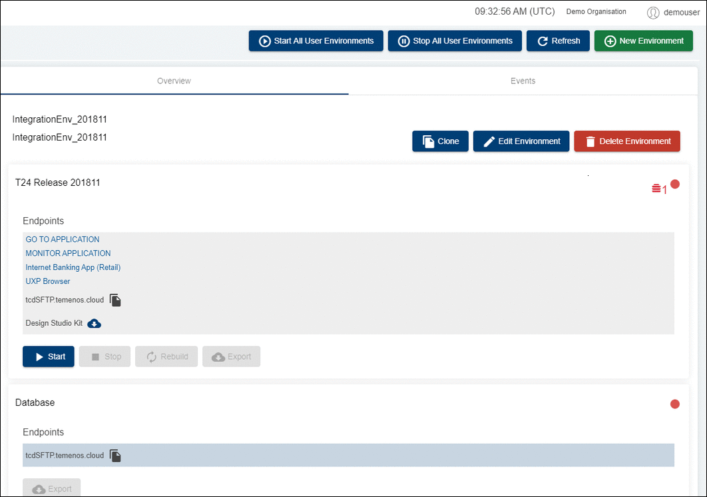

# Environment Basic Operations

After logging to the portal, go to the Environments tab on the left menu > you will see available two buttons: Refresh and New Environment.

After creating an environment, there are several actions (operations) that can be done via the available buttons: clone, edit, delete, start, stop, rebuild, export the database, boost and deploy the repository and also using the endpoints related to T24, the database or to the repository.
 
 

 

 **Refreshing** the page:

- Use this button to refresh any action in progress (related to an environment but also to a factory).

 

 **Creating** a new environment:

- Displays the fields required to create an environment. here you can give a name and a description to your environment and choose a template.

 

 **Cloning** an environment:

-  Creates an identical environment by copying the Environment and configuration repository.

 

 **Editing** an environment:

- Allows you to change the name and the description of an environment.

 

 **Deleting** and environment:

- Stops all instances of an Application in the Environment, removes all resources including configuration repository.

 **Starting** an environment:

- After creating an environment, the Start button is automatically disabled as the environment is running. It will be enabled if an environment is stopped and it will start all the instances specified in the Environment configuration.

- When the environment is stopped, start button is supposed to start the VMs where the database and the application server of a T24 environment are installed and also to start the application server (jboss, wildfly, WebSphere, etc.) so that T24 to be up and running. 
- However, please **note** that start button is not triggering also the deployment of whatever is present into the associated Git repository (like something that was committed when the environment was stopped or a T24 update package ( L1 development) that was not yet successfully deployed to the T24 area).

 

 **Stopping**  an environment:

- Stops all running instances of an Application in an Environment.

 

 **Rebuilding** an environment:

- It recreates the resourses into the cloud and re-installs T24 and H2 db.
- This is used for example when modifying the application templates (like changing the T24 displayed name or addign a new application).

 

 **Exporting** an environment and exporting the database:

- Allows to export and import an environment or a database through SFTP server.

 

 **Boosting** 

- Used to apply the changes made to the environments' repository (you can modify the infra-templates, the playbooks or the roles).

 

**Deploying**

- To be used when deploying newly added plugins, endpoints, updates, web services, packages etc.

 

> [!Note]
> **IMPORTANT!**
> 
> As a good practice and in terms of reducing your costs, it is recommended that you don't keep an environment **unused** for more than 3 days (for internal clients), respectively for more than 7 days (for external clients). Otherwise, the environment will be deleted by the Extend team (with a previous mail notification).
> 
> Also to reduce costs, the environment can be put on **Stop**.
