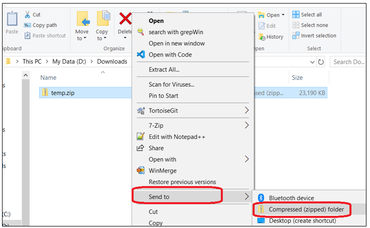
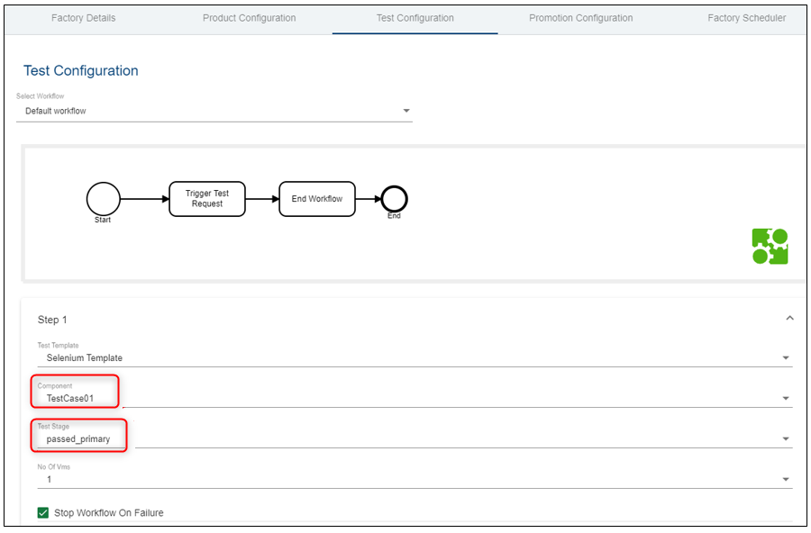
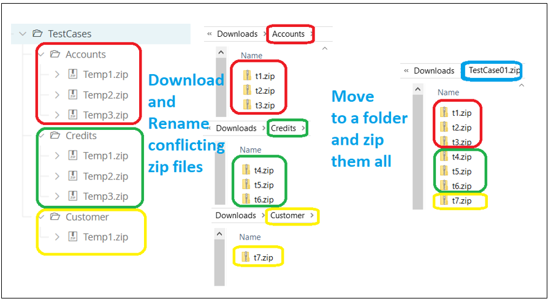

# Factory Migration 

Below you will see what are the steps involved to perform the factory migration from an existing platform.  As part of the platform upgrade process, all the existing Factories of the platform (all organizations) are also migrated. The factory migration involves populating appropriate tables with the default values wherever applicable.  

The end-user will not be able to run a factory until the Test Script component is defined. In order to do so, existing TestCases have to be migrated. The migration is nothing but repackaging existing TestCases in to a format that the platform understands.  Please follow the below steps to migrate the TestCases:

1.  Identify and download the TestCases of the factory in the repository located at {default-stage}/{stream}/{stage}/TestCases/TestCases/testcases.zip.

 
 
 
2. After the download is complete, leave the zip folder with the same name or rename if required.

 
 
 

3. Zip again the downloaded zip file from the Artifactory.

 
 
 

4. Rename the new zip folder if required. This new zip file will be uploaded to the Artifactory. The file's structure should look as below.

 
 
 

5.  Create a new **Component** (eg. TestCase01) in the portal. The **Component Type** will be ‘TestScript’ 

 
 
 

6.	Upload the zip file from the Step 5 on the Artifactory to the required stage

 
 
 

7. Select the previously created **Component** and **Stage** the in the** Test Configuration** of the factory 

 

**Case 1:**
Note that a Test case can have multiple scenarios (.zip files) in a **Stream**. In such cases download all of the .zip files and re-package them again in a single zip file so that it can be uploaded to Artifactory. 
As shown below the multiple .zip files from Artifactory are downloaded and repackaged using a parent zip folder called Accounts.zip. This new zip file will be uploaded to the Artifactory as a component.

 

**Other Scenarios**

**Case 2:**

It is also possible to have multiple Test cases and each Test Case can have multiple scenarios (.zip files). In such cases download all the zip files and rename to avoid conflicting names, archive them to a parent zip folder. 
As shown below by colouring the downloaded zip files are renamed since the zip file names are conflicting and moved to a common folder called TestCase01. This folder TestCase01 should be zipped and uploaded to Artifactory. 

 

> **Notes**:
> 
> •	There is no constraint on folder names. 
> 
> •	Upon successful test execution, i.e. if all test cases are passed then the TestCase01 component will be promoted to target stage.

> •	Only one Test Script/Test Component can be configured in a factory. Thus, if the user wants to run multiple test scenarios and promote it separately to different stages then it should be added in individual factories. 

