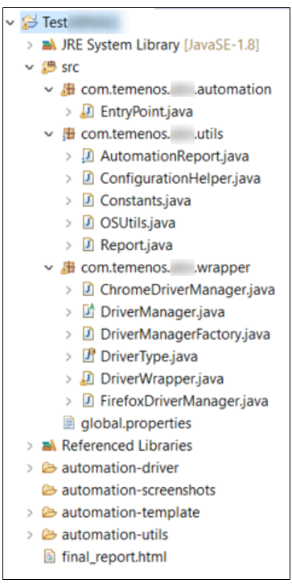
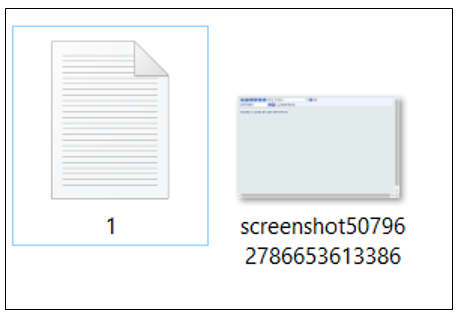

# Selenium Test Template Implementation 

This page explains the steps needed to be followed in order to do the Java implementation for a Selenium Test Template based on the client's framework.

## Implementation 
The Java implementation using Selenium WebDriver automation is using 2 types of browsers:

- Chrome
- Firefox

The structure of the application will be displayed as below. The main class for the application is **EntryPoint.java**.

 

##  Structural design of the application 

The application is using the Factory pattern having a DriverManager class which has 2 implementations for both Firefox and Driver browsers. These are defined in:

- ChromeDriverManger.java 

- FirefoxDriverManager.java

###  A.	“global.properties” file 
-	there are two **browser.type** options: Chrome and Firefox
-	**organization.id** represents the organization ID used to test the template
-	**report.path** represents the path where the report will be saved (HTML format with CSS)

  

### B.	Automation-driver-executable 
This folder contains all the drivers for the Selenium Webdriver:

- the automation-driver-executable folder contains:

 

- the automation-driver-libraries folder contains the Java Selenium WebDriver libraries:

  

### C.	Automation-screenshots  
In this folder will be stored all the screenshots:
 
 

Following the completion of the execution a message will be displayed on the screen:
         

### D.	Reporting 
The reports will be based on the template below:
         

### E.	Execution from command line 
Java –jar CLIENTAutomation.jar

Or with parameters

java -jar CLIENTAutomation.jar **chrome** **e1efgs6bc7ul**

**D:\\DevelopmentLast\\TestCLIENT\\TestCLIENT\\**

where

- the green parameter is the browser [firefox | chrome]

- the red parameter represents the organization ID

- the blue parameter represents the folder which stores the report

##  Packaging JAR file and running with params  
To the Jar file CLIENTAutomation a new automation-driver folder will be added as below:

 

After the automation-driver has been added, the package will be executed:

 